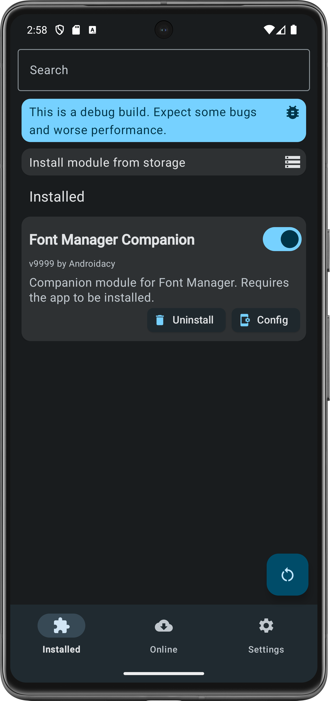
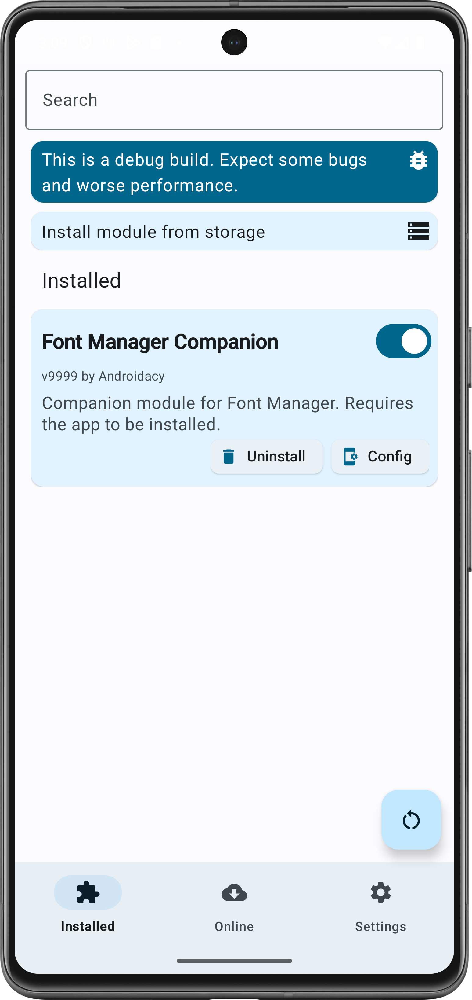

# Androidacy Module Manager

## Introduction

### Developed by Androidacy

Explore our diverse range of offerings on our [official website](https://www.androidacy.com/?utm_source=fox-readme&utm_medium=web&utm_campaign=github-readme).

## Overview and Purpose

The Androidacy Module Manager serves as a robust alternative to the official Magisk Manager app, which has discontinued support for online module downloads.

**Disclaimer:** This application is not officially endorsed by Magisk, KernelSU, Google, or any other affiliated entities.

## Comprehensive Feature Set

- **Module Management:** Download, install, and manage your modules.
- **Search Functionality:** Find new modules.
- **Custom Repository Support:** Add your own repositories.
- **Automatic Updates:** Keeps your system up-to-date.
- **Theming:** Monet theming.
- **User Interface:** Material Design 3 (MD3) compliant.

### Exclusive to Androidacy Repository

- **Security:** Automatic VirusTotal scans.
- **Community Engagement:** Module reviews.
- **Revenue Sharing:** Financially rewards module developers.
- **Ad-Supported:** Ads allow us to keep this app and our repository free, but can be removed with a subscription. [Subscribe Now](https://www.androidacy.com/membership-join/?utm_source=fox-readme&utm_medium=web&utm_campaign=github-readme)

### Future Updates

- Repository Creation Wizard
- Module Creation Tool

### Screenshots

#### Dark | Light

 

### Default Repositories

- [Androidacy](https://www.androidacy.com/magisk-modules-repository/?utm_source=fox-readme&utm_medium=web&utm_campaign=github-readme): Fast, optimized, and secure. The official Androidacy repository. May display non-intrusive ads.
- [Magisk Alt Repo](https://github.com/Magisk-Modules-Alt-Repo/): A community-driven repository for Magisk modules. Not affiliated with Magisk or Topjohnwu, and may contain low-quality or malicious modules.

## Community Engagement and Support

Join our [Telegram Group](https://telegram.dog/androidacy_discussions?utm_source=fox-readme&utm_medium=web&utm_campaign=github-readme).

## System Requirements

### Minimum and Recommended Specifications

- **Android OS:** 8.0 / 9.0+
- **Magisk:** 21.0 / 24.0+
- **KernelSU (Experimental Support):** 0.5.0+ / Latest
- **Internet Connectivity:** Required / Stable Wi-Fi Recommended

> **Note:** A VPN may be required in certain regions.

## Installation Guidelines

Visit [our website](https://www.androidacy.com/downloads/?view=FoxMMM&utm_source=fox-readme&utm_medium=web&utm_campaign=github-readme) to download the latest `.apk`.

## Developer Guidelines

Consult our [Developer Documentation](docs/DEVELOPERS.md?utm_source=fox-readme&utm_medium=web&utm_campaign=github-readme).

## Translation Contributions

Visit our [Weblate page](https://translate.nift4.org/engage/foxmmm/?utm_source=fox-readme&utm_medium=web&utm_campaign=github-readme). Advanced users may also send us a pull request on GitHub.

## Legal and Compliance

By using this application, you agree to abide by our [Terms of Service](https://www.androidacy.com/terms/?utm_source=fox-readme&utm_medium=web&utm_campaign=github-readme), our [LICENSE](LICENCE?utm_source=fox-readme&utm_medium=web&utm_campaign=github-readme) and the  [EULA](https://www.androidacy.com/foxmmm-eula/?utm_source=fox-readme&utm_medium=web&utm_campaign=github-readme). **If you do not agree to any of those terms, you are to discontinue usage of the app immediately.**

## Disclaimer

THIS SOFTWARE IS PROVIDED "AS IS" WITHOUT WARRANTY OF ANY KIND, EITHER EXPRESSED OR IMPLIED, INCLUDING, BUT NOT LIMITED TO, THE IMPLIED WARRANTIES OF MERCHANTABILITY AND FITNESS FOR A PARTICULAR PURPOSE. ANDROIDACY CANNOT BE HELD LIABLE FOR ANY DAMAGES ARISING OUT OF THE USE OF THIS SOFTWARE, EVEN IF ADVISED OF THE POSSIBILITY OF SUCH DAMAGE.

> **Copyright © 2023 Androidacy. All rights reserved.** Logos, names, and brands are property of Androidacy or our affiliates unless otherwise stated and are protected under US copyright law. See LICENSE for information on source code licensing.

This app was originally known as Fox's Magisk Module Manager (FoxMMM). We thank Fox2Code for the foundational work on this app.